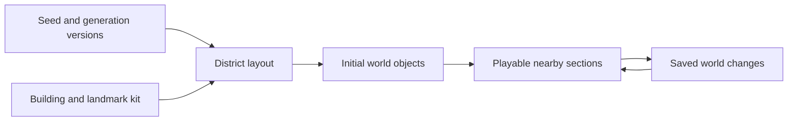

# Procedural world generation

Status: design direction. Generation, streaming, and persistence have not been implemented or tested in Unreal.

## The intended experience

The player can keep exploring a realistic ruined city and discover new districts, supplies, and settlements. A world seed determines the initial world. Streets and buildings remain recognizable on return, while scavenging, deaths, raids, and construction change their state.

Use authored modular streets, buildings, interiors, and landmark templates with procedural placement and variation. District rules can produce residential streets, commercial blocks, industrial areas, and distinctive destinations. Start with a small kit and expand its variety after the survival loop works.

The goal is an effectively open-ended feeling of exploration. Supported coordinates, travel distance, save size, and loading cost need measured limits. Large amounts of repeated content will still feel repetitive, so landmark variety and useful routes remain content-design work.

## From a seed to a playable district

1. Derive regional structure and connected road entrances from the seed and region coordinates.
2. Divide suitable land into blocks and lots using consistent rules across neighboring regions.
3. Place building and landmark templates, including entrances, interiors, and stable slots for persistent objects.
4. Create initial containers, supplies, infected, and settlement records from their own stable generation inputs.
5. Apply saved changes and register each active object's single current owner and location.
6. Make the section playable when required collision and navigation are ready.

Plan shared streets and boundary connections from common regional inputs. A road crossing a boundary must agree on position and height from both sides. Assign one owning section to features that span boundaries so generation cannot create duplicate buildings or containers.

Generation must be independent of exploration order. Use stable integer coordinates and explicit per-feature random inputs derived from the world seed, generator version, and feature key. Keep decorative randomness separate from layout and gameplay randomness so adding litter cannot change a container's identity or contents.

## Streaming and simulation

Maintain a bounded set of active sections around the player and prepare nearby sections ahead of movement. Unloading releases transient actors and meshes after their persistent changes are captured. Limit work per frame and generation retries; an unsuitable layout needs a tested fallback.

Unreal's [PCG runtime generation](https://dev.epicgames.com/documentation/en-us/unreal-engine/using-pcg-generation-modes-in-unreal-engine) can generate and clean up content near generation sources. [World Partition](https://dev.epicgames.com/documentation/en-us/unreal-engine/world-partition-in-unreal-engine) streams a world using grid cells. The city's layout rules and lifecycle for dynamically generated gameplay sections require project-specific implementation. Validate their integration in the selected engine release.

Treat PCG-generated visual details and persistent gameplay objects according to their ownership. Rebuilding decoration must preserve inventory records, constructed objects, and actor identities. A cleanup callback must not erase persistent progress.

Keep logical region coordinates separate from local positions within a region. Establish a supported traversal range and test physics, rendering, navigation, and save coordinates at its edges. Select any coordinate rebasing strategy through that technical work.

Only nearby survivors and infected need full movement and combat simulation. Initially pause distant actors with their state saved. Bound AI destinations to the active district so one scavenger cannot force an endless chain of region loads. Broader settlement simulation can be added after this works.

## Persistence and scarce resources

Save the world seed and generation versions, plus changes against that initial world. Changes include emptied containers, removed spawns, stockpile quantities, actor inventories and positions, and player construction. Saved records grow as exploration and world changes accumulate, so bounded active memory does not imply constant disk use.

A survivor moving between sections retains one identity and one inventory. Persist its current location and suppress its original generated spawn. Capture cross-section transfers consistently so regeneration cannot duplicate a scavenger or its supplies.

Pin generator and building-kit compatibility for each world. Changing a template's slots, roads, or building placement can invalidate old saves. Preserve compatible generation or provide a deliberate migration or new-world choice, with backups for migrations.

Fresh districts offer additional resources, while visited locations keep their depletion. Use travel time, carrying capacity, local threats, and the value of returning home to sustain competition over nearby resources. Test whether these costs make raiding and defending settlements worthwhile.

## First technical milestone

Use a small set of fixed seeds and adjacent map sections with simple geometry. Include one shelter, a supply route, and a rival stockpile. Demonstrate these behaviors before investing in a large building library:

- Repeat a seed and generation version to obtain identical base layouts and stable identities.
- Generate neighbors in different orders, including negative coordinates; roads and shared boundary features agree.
- Cross boundaries with the player and an AI scavenger, with working collision and navigation after reloading either side.
- Take the last item, unload its section, save, and return: the container stays depleted and the item has one owner.
- Unload a scavenger carrying supplies and reload its current section: one scavenger and one inventory remain.
- Place a barricade near a boundary, leave, and return: placement, collision, and damage state survive.
- Across test seeds, reach starting supplies and the rival outpost; handle invalid layouts with bounded retries and a fallback.
- Repeated exploration and revisits keep active actor counts and memory within measured budgets; record generation spikes and save growth.

Future multiplayer adds multiple generation sources and authoritative shared changes. Shared seeds and compatible generator versions recreate the base layout; the server must still resolve resource ownership and all subsequent world changes.
